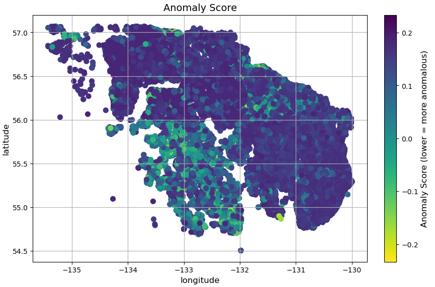

<a href="https://www.minersai.com/">
  
</a>

# **Multivariate Outlier Detection in Geochemical Datasets**

#### _Tyler Howe, February 2025_

This repository provides an open-source resource for exploring, analyzing, and comparing three different methods of multivariate outlier detection in geochemical datasets in the context of mineral exploration.



## **Outlier Detection Methods**

The three primary outlier detection algorithms explored in this project are:

- **Isolation Forest (IF)** – _(Liu et al., 2008)_
- **Local Outlier Factor (LOF)** – _(Breunig et al., 2000)_
- **Angle-Based Outlier Detection (ABOD)** – _(Kriegel et al., 2008)_

These techniques aim to identify geochemical anomalies that may indicate mineralization zones or other significant geological features.

## **Background**

This work is inspired by Antoine Caté's research on multivariate outlier detection for mineral exploration and builds upon various established anomaly detection methodologies.

## G's python setup and how to install and run

### To restart from scratch

Should have a virtualenv with python3 locally, if not

```sh
python3 -m venv myenv
```

Then activate it and install depencies in it

```sh
source ./myenv/bin/activate
pip install -r requirements.tx
```

### To add a dependency

If `pip-tools` is not installed globally install it in the venv

```sh
pip install pip-tools
```

add dependecy manually in `requirements.in` then, to generate `requirements.txt`, run

```sh
pip-compile requirements.in
```

then install these requirements either with `pip -r requirements.txt`.

There's also `pip-sync` but I'm not sure if it would be better and it might actually remove pip-tools since that on cannot be in local.

### Notebooks then run in VSCode using myenv as kernel

## **Installation & Usage**

To run the notebook, ensure you have the following dependencies installed:

### **Built-in Modules**

- `time`
- `importlib`
- `typing.Tuple`

### **Third-Party Libraries**

- `pandas`
- `numpy`
- `matplotlib.pyplot`
- `seaborn`
- `scipy.spatial` (`cKDTree`, `KDTree`)
- `scipy.stats` (`f_oneway`)
- `sklearn.ensemble` (`IsolationForest`)
- `sklearn.neighbors` (`LocalOutlierFactor`)
- `sklearn.preprocessing` (`StandardScaler`)
- `sklearn.decomposition` (`PCA`)
- `sklearn.metrics` (`roc_auc_score`, `roc_curve`, `auc`, `mutual_info_score`)

## **References**

- Breunig, M.M., Kriegel, H.-P., Ng, R.T., and Sander, J., 2000, LOF: Identifying density-based local outliers: _ACM SIGMOD Record_, v. 29, no. 2, p. 93–104. [https://doi.org/10.1145/335191.335388](https://doi.org/10.1145/335191.335388)
- Caté, A., 2025, 6: Multivariate outlier detection for mineral exploration: _LinkedIn Pulse_, accessed February, 2025, at https://www.linkedin.com/pulse/6-multivariate-outlier-detection-mineral-exploration-antoine-cat%C3%A9-vd4kc/.
- Granitto, M., Schmidt, J.M., Shew, N.B., Gamble, B.M., and Labay, K.A., 2013, Alaska Geochemical Database Version 2.0 (AGDB2)—Including "Best Value" data compilations for geochemical data for rock, sediment, soil, mineral, and concentrate sample media: _U.S. Geological Survey Data Series 759_, Version 1.0, Denver, CO, accessed February, 2025, at https://doi.org/10.3133/ds759.
- Kriegel, H.-P., Schubert, M., and Zimek, A., 2008, Angle-based outlier detection in high-dimensional data: _Proceedings of the 14th ACM SIGKDD International Conference on Knowledge Discovery and Data Mining_, Las Vegas, Nevada, USA, Association for Computing Machinery, p. 444–452. [https://doi.org/10.1145/1401890.1401946](https://doi.org/10.1145/1401890.1401946).
- Liu, F.T., Ting, K.M., and Zhou, Z.-H., 2008, Isolation Forest: _Eighth IEEE International Conference on Data Mining_, p. 413–422. [https://doi.org/10.1109/ICDM.2008.17](https://doi.org/10.1109/ICDM.2008.17).
- Maklin, C., 2022, Isolation Forest: _Cory Maklin - Medium_, accessed at [https://medium.com/@corymaklin/isolation-forest-799fceacdda4](https://medium.com/@corymaklin/isolation-forest-799fceacdda4).
- Saudi Geological Survey (SGS), [2023], [Dataset RGP GSAS Geochemical survey Jabal Al Hasir]: _Saudi Geological Survey Data Portal_, accessed [February, 2025], at [https://ngdp.sgs.gov.sa/ngp/].
- Saudi Geological Survey (SGS), [2023], [Mineral Occurrence Documentation System (MODS) Database]: _Saudi Geological Survey Data Portal_, accessed [February, 2025], at [https://ngdp.sgs.gov.sa/ngp/].
- Shahrestani, S., and Sanislav, I., 2025, Mapping geochemical anomalies using angle-based outlier detection approach: _Journal of Geochemical Exploration_, v. 269. [https://doi.org/10.1016/j.gexplo.2024.107635](https://doi.org/10.1016/j.gexplo.2024.107635)
- U.S. Geological Survey (USGS), 2008, Alaska Resource Data File (ARDF): _U.S. Geological Survey Open-File Report 2008-1225_, accessed February, 2025, at https://mrdata.usgs.gov/ardf/.
